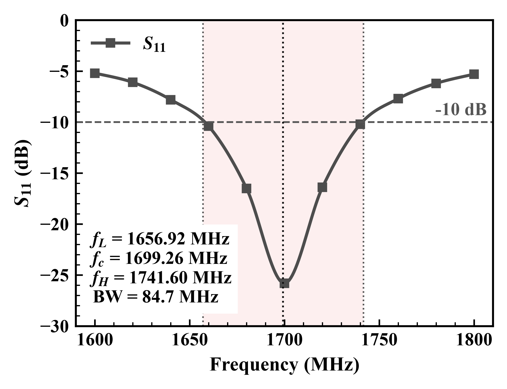
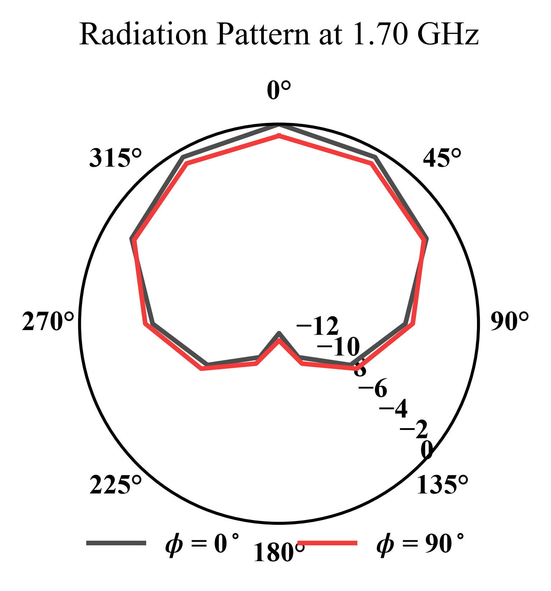
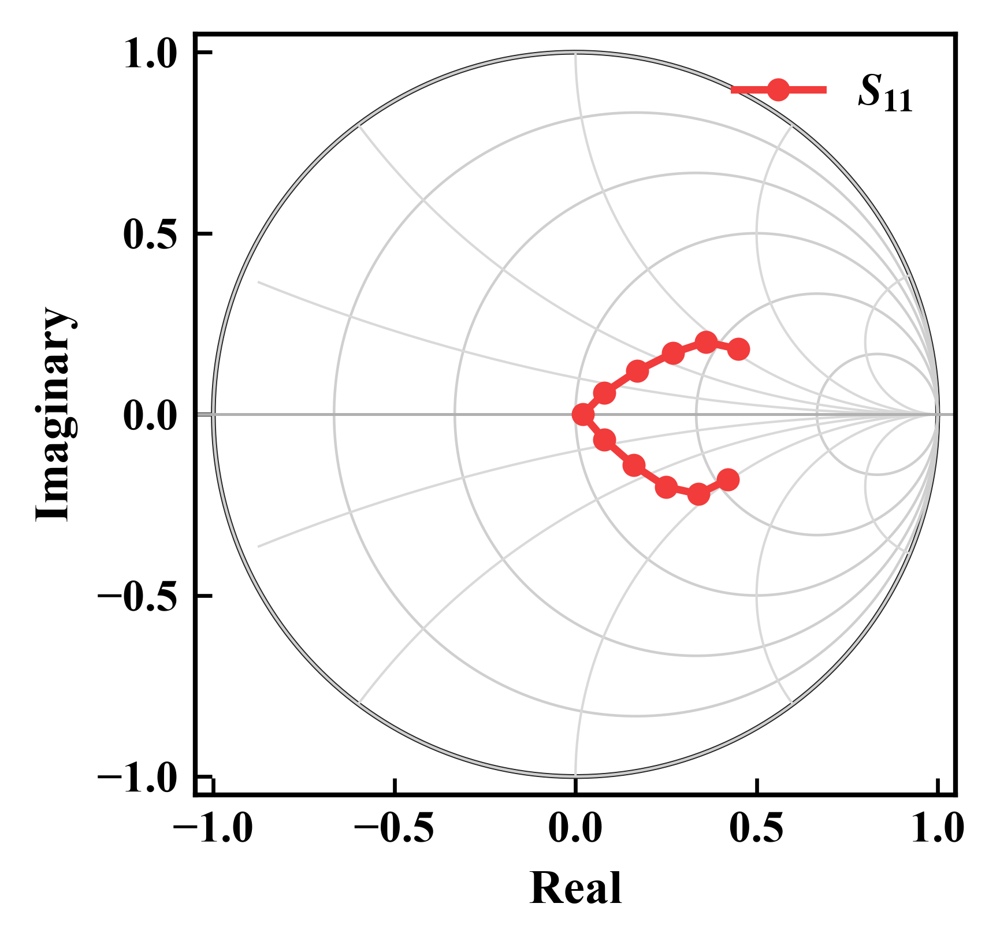

# AntPlot — Antenna and RF Scientific Plotting Tool

**面向 HFSS、CST、ADS 和 VNA 数据的本地科研绘图工具**

Turn HFSS, CST, ADS, VNA and generic CSV data into reproducible, publication-ready antenna and RF figures.

AntPlot is a local scientific plotting application and reproducible engineering plotting workflow. It reads local files, renders previews through the Python backend, and keeps source data and exports on the user's computer.

[](https://github.com/plumageF/AntPlot/actions/workflows/validate.yml) [](LICENSE) [](https://github.com/plumageF/AntPlot/releases)

**入口 / Quick links:** [Windows Quick Start](#windows-quick-start) · [Source Installation](#source-installation) · [User Guide](docs/USER_GUIDE.md) · [Example Gallery](examples/gallery) · [Releases](https://github.com/plumageF/AntPlot/releases) · [Test Report](docs/TEST_REPORT_v0.1.0.md)


## What AntPlot does / 项目定位

- Imports HFSS, CST, ADS, VNA and manually prepared CSV-style data.
- Recognizes S-parameters, VSWR, realized gain, axial ratio, efficiency, HPBW, radiation patterns and Smith-chart data.
- Supports automatic recognition, semi-automatic mapping confirmation, manual override, and free XY Multi-Curve mode.
- Overlays simulated, measured, reference and parameter-sweep curves with reproducible styles.
- Renders Cartesian and polar radiation patterns through the same backend used for export.
- Exports PNG (600 dpi), PDF, SVG, JSON configuration and engineering reports.

## Supported plot types

| Plot | Typical input | Notes |
| --- | --- | --- |
| S11 / Return Loss | Frequency + dB or derived complex data | Threshold and bandwidth checks |
| VSWR | Frequency + VSWR or S11 | VSWR threshold checks |
| Realized Gain | Frequency + gain | Uses dBi when absolute |
| Radiation Pattern | Theta/Phi/Angle + gain or polarization component | Cartesian or polar |
| Axial Ratio | Frequency or angle + AR | 3 dB threshold |
| Efficiency / HPBW | Frequency or derived pattern data | Engineering checks with warnings |
| Smith Chart | re/im S or impedance, mag/phase | Reference impedance must be confirmed |
| XY Multi-Curve | Standard wide-table CSV | No engineering pass/fail conclusions |

## Screenshots and example gallery

The gallery contains real backend-generated figures and their input CSV files:





See [examples/gallery/README.md](examples/gallery/README.md) for the input, plot type, settings and expected result of each example. Screenshots are intentionally based on real project outputs; no mock UI images are included.

## Windows Quick Start

Download [`AntPlot-Windows-Quick-Start-v0.1.1.zip`](https://github.com/plumageF/AntPlot/releases/download/v0.1.1/AntPlot-Windows-Quick-Start-v0.1.1.zip) from the [latest Release](https://github.com/plumageF/AntPlot/releases/latest). The package includes a prebuilt frontend, backend source, examples and documentation. It is a **Quick Start package, not a standalone EXE**: Python 3.10+ is still required; Node.js and pnpm are not required.

1. Extract the ZIP to a writable folder.
2. Confirm `py -3` or `python` reports Python 3.10 or newer.
3. Run `install_and_start.bat`.
4. Open <http://127.0.0.1:4173/>.

The first run installs Python dependencies and needs network access. Later launches can use `start_portable.bat`.

## GitHub Packages / Docker

AntPlot is also published as a GitHub Container Registry package:

```powershell
docker pull ghcr.io/plumagef/antplot:v0.1.1
docker run --rm -p 4173:4173 -p 8765:8765 ghcr.io/plumagef/antplot:v0.1.1
```

Open <http://127.0.0.1:4173/> after the container starts. The frontend is served on port `4173`; the backend plotting API is served on port `8765`.

## Source Installation

```powershell
git clone https://github.com/plumageF/AntPlot.git
cd AntPlot
py -3 -m venv .venv
.\.venv\Scripts\Activate.ps1
python -m pip install -r requirements.txt
corepack enable
cd frontend
pnpm install --frozen-lockfile
pnpm build
cd ..
.\start_app.bat
```

Open `http://127.0.0.1:4173/`. The local API is bound to `127.0.0.1:8765` by default. If PowerShell blocks scripts, use the `.bat` launchers or run the equivalent commands manually.

## Input data and engineering checks

Read [Data Formats](docs/DATA_FORMATS.md) before preparing a CSV. Automatic recognition checks names, units, sweeps, fixed variables and curve families; ambiguous fields remain warnings or require confirmation. The application does not estimate engineering results from image pixels, silently smooth data, or silently delete abnormal points. Reference impedance, de-embedding, pattern cut, polarization and normalization state must be reviewed by the user.

AntPlot assists with data visualization and engineering checks, but it does not replace simulation setup review, calibration verification or professional engineering judgment.

## Testing

```powershell
python -m pip install -r requirements.txt
python tools\recognition_regression.py
python tools\final_acceptance.py
cd frontend
pnpm install --frozen-lockfile
pnpm build
```

The public acceptance suite uses only repository fixtures and does not depend on `D:\CSV`, `G:\` or any developer-specific path. Results and generated artifacts are described in [the v0.1.0 test report](docs/TEST_REPORT_v0.1.0.md).

## Repository structure

```text
src/hfss_paperplotter/  Python parsing, recognition, plotting, metrics and API
frontend/               React + Tailwind interface
examples/               Public fixtures and generated gallery figures
tools/                  Regression and acceptance runners
docs/                   User, data, release and development documentation
styles/                 Plot style definitions
```

## Roadmap

### v0.2

- Improve Touchstone S1P/S2P validation.
- Add more measured-versus-simulated templates.
- Improve batch plotting and project recovery.
- Add more non-standard CST/ADS column fixtures.

### Future

- Standalone Windows executable.
- Linux and macOS launch support.
- Additional publication style presets.
- Optional plugin architecture.

These are plans, not current guarantees.

## Contributing, security and citation

See [CONTRIBUTING.md](CONTRIBUTING.md), [SECURITY.md](SECURITY.md), [CITATION.cff](CITATION.cff), and [CHANGELOG.md](CHANGELOG.md).

## License

MIT. See [LICENSE](LICENSE).
